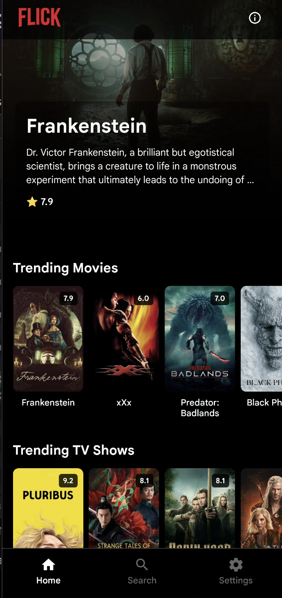
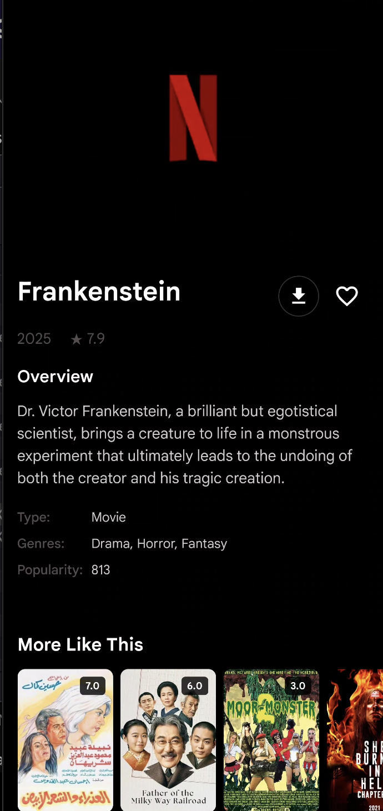
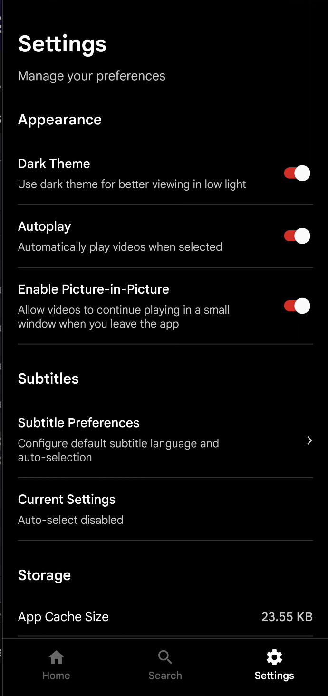
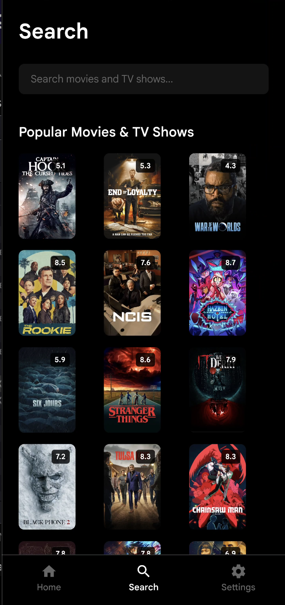
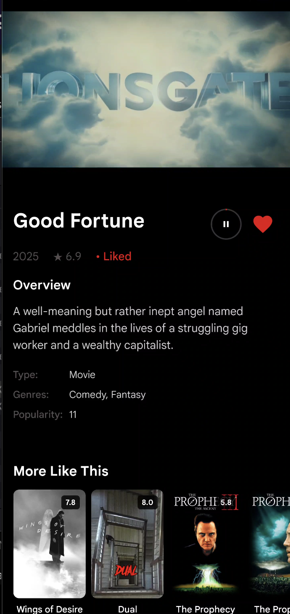

# Flickv4

A modern React Native streaming experience that brings ad-free movies and TV shows to mobile devices with offline downloads, subtitle controls, and a polished Netflix-inspired UI.

## Overview

- **Stack**: React Native 0.82, React 19, TypeScript, React Navigation, Axios
- **Platforms**: Android and iOS (Apple Silicon and Intel Macs supported)
- **Data**: Powered by TMDB with local caching for resilient offline UX

## Screenshots

| Home | Detail | Downloads |
| --- | --- | --- |
|  |  |  |

| Search | Settings |
| --- | --- |
|  |  |

## Features

- Personalized home screen with trending, continue watching, and curated rows
- Deep TMDB integration for metadata, credits, trailers, and artwork
- High quality video playback with `react-native-video`, Google Cast, and subtitle selection
- Background downloads with pause/resume, progress indicators, and offline playback
- Optimized image loading and caching strategies for low bandwidth environments
- Dark theme-first UI with responsive layouts and accessibility helpers

## Prerequisites

- Node.js 20+ and npm 10+ (or yarn 1.22+ if preferred)
- Watchman (recommended on macOS) and Xcode 15+ for iOS builds
- Android Studio with Android SDK 34, NDK (side by side), and an emulator/device
- Ruby 3.x with CocoaPods (`sudo gem install cocoapods`) for iOS dependencies
- TMDB API key (configure in `src/utils/constants.ts` before shipping)

## Getting Started

Clone the repository and install dependencies:

```bash
git clone https://github.com/sheeshcake/Flickv4.git
cd Flickv4
npm install
```

Install native dependencies:

```bash
# iOS
cd ios
pod install
cd ..
```

For Android, open the project in Android Studio the first time so Gradle can install any missing SDK components.

Launch the Metro bundler and run on your target platform:

```bash
npm start        # Metro bundler
npm run android  # Android device/emulator
npm run ios      # iOS simulator (requires Mac)
```

## Configuration

- Update `TMDB_CONFIG.API_KEY` in `src/utils/constants.ts` with your TMDB key.
- Customize theming colors in `src/utils/theme.ts` and `src/utils/constants.ts`.
- Supply custom app icons and splashes under `android/app/src/main/res` and `ios/Flickv4/Images.xcassets`.
- Download storage defaults to the app sandbox; change paths in `src/services/DownloadService.ts` if needed.

## Scripts

- `npm run android`: Build and launch the Android app in debug
- `npm run ios`: Build and launch the iOS app (requires simulator or device)
- `npm start`: Start Metro bundler without launching a target
- `npm run build:android`: Generate a release build for Android
- `npm run lint`: Run ESLint using React Native defaults
- `npm test`: Execute Jest unit tests in `__tests__/`

## Testing

- Unit tests reside in `__tests__` and `src/**/__tests__`; run `npm test`.
- Component behavior relies on cached data and downloads; consider using mocks under `src/utils/__mocks__`.
- For end-to-end flows, React Native Testing Library or Detox can be layered on top (not included out of the box).

## Project Structure

- `src/components`: Reusable UI primitives and feature widgets (media player, subtitle selector, offline banner)
- `src/services`: API, caching, storage, and download service abstractions
- `src/navigation`: Tab and stack navigators for core screens
- `src/screens`: Feature screens (Home, Detail, Downloads, Search, Settings)
- `src/utils`: Responsive helpers, network utilities, theme, and constants
- `screenshots`: App previews embedded in this README

## Credits

- [Wendale Franz Dy](https://github.com/sheeshcake) - Creator, maintainer, scraper updates
- [Elijah Abgao](https://github.com/skeltonmod) - Scraper and data provider

## Support

<a href="https://www.paypal.com/paypalme/wfrdee" target="_blank"></a>

## License

MIT

---

> GitHub [@sheeshcake](https://github.com/sheeshcake) · Facebook [@wfrdee](https://facebook.com/wfrdee)

