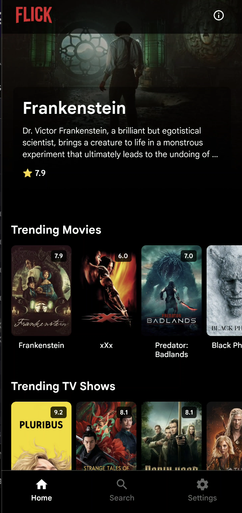
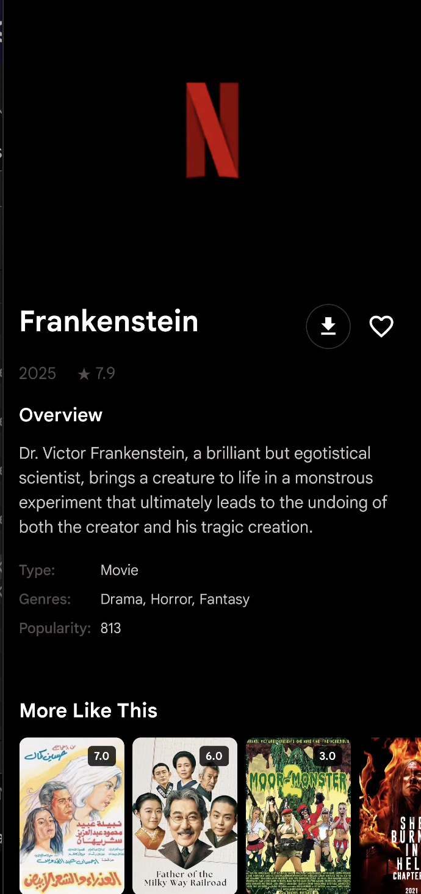
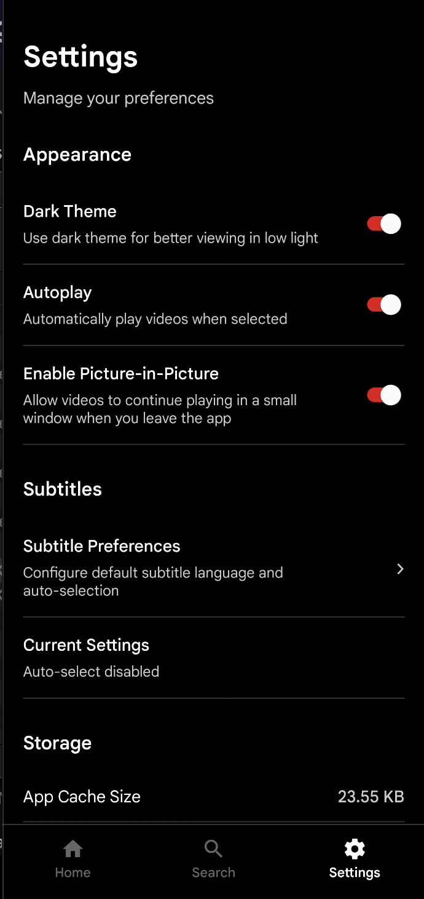
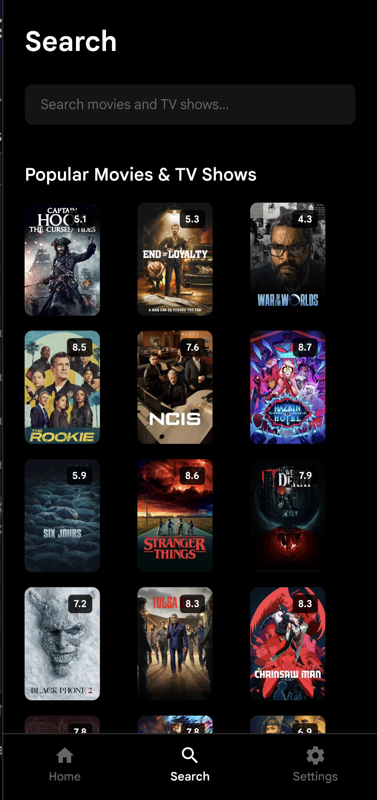
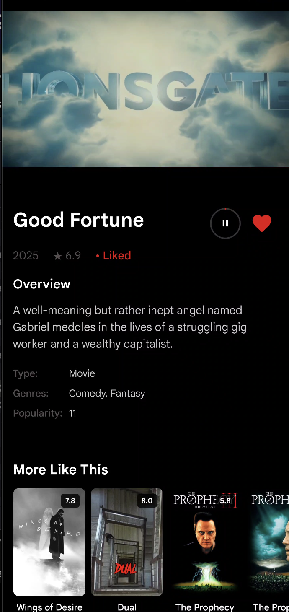

  
  
  <h1>Flickv4</h1>
  
<strong>Your Personal Streaming Sanctuary</strong>

  
A premium, ad-free streaming experience that brings thousands of movies and TV shows to your fingertips—with offline downloads, intelligent subtitle controls, and a beautifully crafted Netflix-inspired interface.

  
  

    
    
    
    
  

---

## ⚠️ Important Notice: Web Scraper Migration

> **The web scraping engine is being moved to a private repository.**

I'll be honest—I built a powerful web scraping strategy for this app, and one of my first mistakes was making it fully public. Moving forward, **all updates to the web scraper will no longer be available in this public repository**.

I know this might sound selfish, but here's why this decision is necessary:

### 🔒 Why Private?

| Reason | Explanation |
|--------|-------------|
| **Longevity & Sustainability** | Public scrapers have a short lifespan. Content providers actively monitor GitHub for scraping code and quickly patch against well-known techniques. Keeping it private ensures the scraper remains functional for longer. |
| **Preventing Abuse** | When scraping logic is public, it can be weaponized by bad actors—overwhelming source servers, getting IPs banned, or being used for malicious purposes that ruin it for everyone. |
| **Protecting the Community** | Ironically, keeping it private protects legitimate users. Once a scraper goes viral, it gets blocked, and suddenly *nobody* can use it. |
| **Avoiding Arms Race** | Every time scraping code is public, it accelerates the cat-and-mouse game. Private development allows for more stable, long-term solutions without constantly firefighting patches. |
| **Personal Investment** | I've spent countless hours building and maintaining this. It's not about gatekeeping knowledge—it's about protecting something I've worked hard on so it can continue to serve its purpose. |

**The rest of the app—UI, features, architecture—remains fully open source.** This is purely about keeping the scraper alive and functional.

I appreciate your understanding. 🙏

---

## 🎬 Why Flickv4?

**No Ads. No Subscriptions, No Bullshits. Just Pure Entertainment.**

In a world cluttered with subscription services and intrusive advertising, Flickv4 offers a refreshingly simple alternative. Built with React Native and powered by TMDB's comprehensive media database, this app delivers a premium streaming experience that respects your time and attention.

### 🚀 What Makes It Special

- **🎯 Zero Friction Streaming** — Instant playback with intelligent caching that adapts to your network conditions
- **📱 True Offline Mode** — Download your favorites and watch anywhere, even on a plane at 30,000 feet
- **🎨 Stunning Interface** — Meticulously crafted dark-first UI that rivals Netflix's polish
- **🌍 Accessibility First** — Comprehensive subtitle support with customizable styling and positioning
- **⚡ Lightning Fast** — Optimized image loading and data persistence for instant app launches
- **🔄 Smart Resume** — Pick up exactly where you left off.

### 💎 Premium Features

| Feature | Description |
|---------|-------------|
| **Continue Watching** | Smart playback history that remembers your progress across every show and movie |
| **Google Cast Ready** | Stream seamlessly to your TV with built-in Chromecast support |
| **Advanced Subtitles** | Choose from multiple languages, adjust size, color, and position |
| **Download Manager** | Pause, resume, and manage offline content with progress tracking |
| **TMDB Integration** | Rich metadata including cast, crew, trailers, ratings, and recommendations |
| **Responsive Design** | Gorgeous layouts that adapt perfectly to phones and tablets |

---

## 📸 See It In Action

### Home Experience

*Personalized rows featuring trending content, your watchlist, and genre collections*

### Rich Detail Pages

*Complete metadata, cast info, trailers, and instant playback*

### Smart Downloads

*Background downloads with progress tracking and offline playback*

### Powerful Search

*Find anything instantly with real-time TMDB search*

### Your Settings

*Customize subtitles, downloads, and app preferences*

---

## 🤝 Contributing

If Flickv4 has enhanced your streaming experience, consider supporting continued development:

Your support helps maintain the project, add new features, and keep the scraper infrastructure running.

---

## 👨‍💻 Author

**Wendale Franz Dy**
- GitHub: [@sheeshcake](https://github.com/sheeshcake)
- Facebook: [@wfrdee](https://facebook.com/wfrdee)

---

## 📄 License

This project is licensed under the **GNU General Public License v3.0 (GPL-3.0)** - see the [LICENSE](LICENSE) file for details.

### What This Means For You:

| ✅ You Can | ⚠️ You Must | ❌ You Cannot |
|-----------|-------------|---------------|
| Use commercially | **Credit the original author** | Hold the author liable |
| Modify the code | **Disclose your source code** | Sublicense |
| Distribute copies | **State changes you made** | Use without attribution |
| Use privately | **Use the same license (GPL-3.0)** | |

**In short:** Fork it, modify it, build on it—but give credit where it's due and keep it open source.

---

## ⚖️ Legal Disclaimer

Any legal issues regarding the content on this application should be taken up with the actual file hosts and providers themselves as we are not affiliated with them. In case of copyright infringement, please directly contact the responsible parties or the streaming websites. The app is purely for educational and personal use. Flick(v4) does not host any content on the app, and has no control over what media is put up or taken down. Flick(v4) functions like any other search engine, such as Google. Flick(v4) does not host, upload or manage any videos, films or content. It simply crawls, aggregates and displayes links in a convenient, user-friendly interface. It merely scrapes 3rd-party websites that are publicly accessable via any regular web browser. It is the responsibility of user to avoid any actions that might violate the laws governing his/her locality. Use Flick(v4) at your own risk.

---

## 🌟 Acknowledgments

- **TMDB** for providing a comprehensive and free movie database API
- **React Native Community** for excellent libraries and tooling
- **Open Source Contributors** whose work makes projects like this possible

---

  
**Built with ❤️ and React Native**

⭐ Star this repo if you find it useful!

